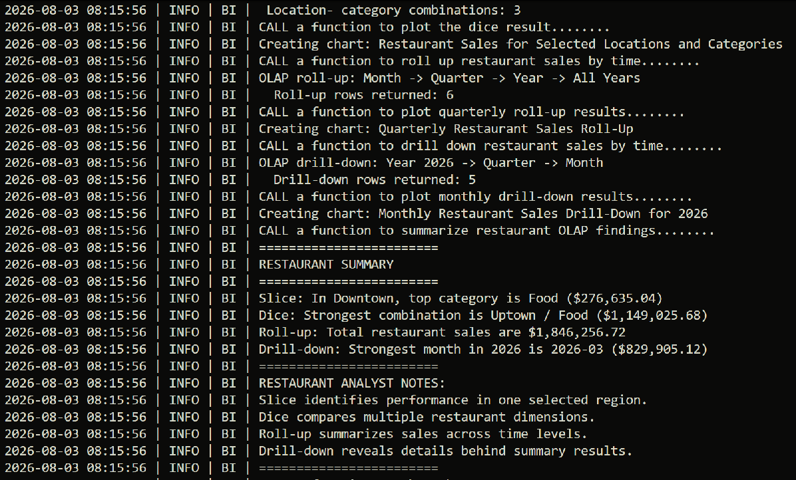
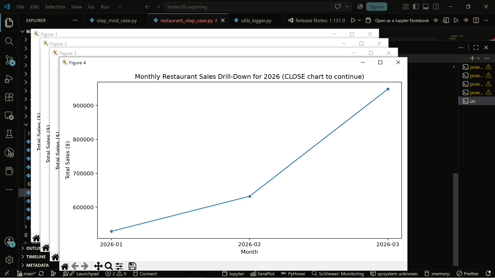
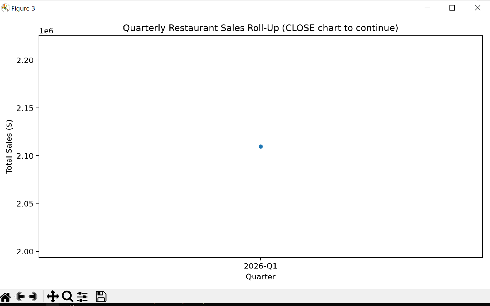
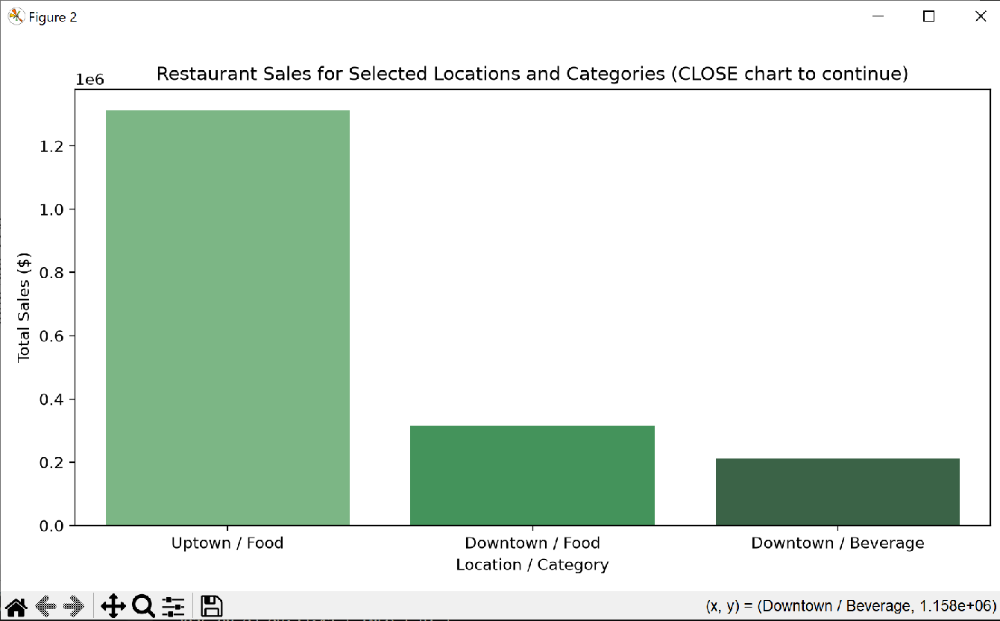
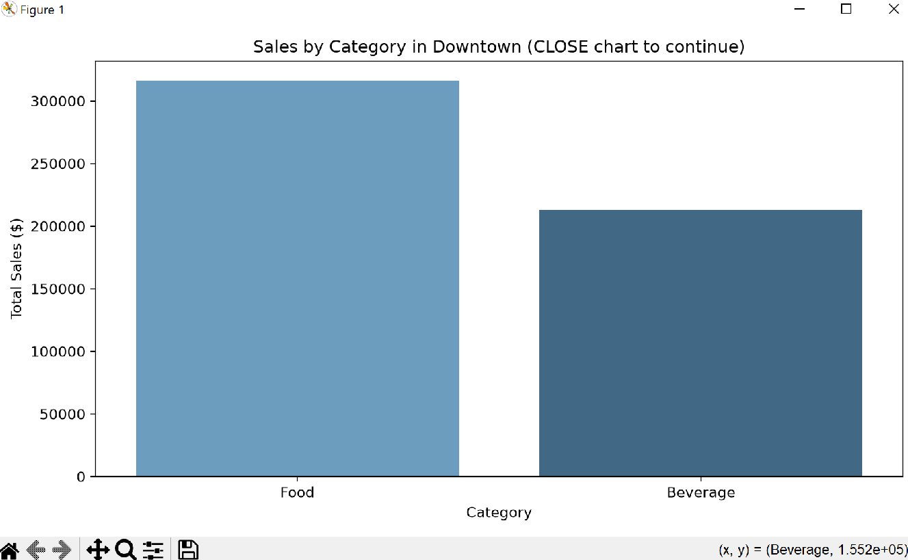

# Project Documentation

This site provides project documentation.
Use the documentation navigation to explore.

## How-To Guide

Many instructions are common to all our projects.

See
[⭐ **Workflow: Apply Example**](https://denisecase.github.io/pro-analytics-02/workflow-b-apply-example-project/)
to get the example projects running on your machine.

## Project Documentation Pages (docs/)

- **Home** - this documentation landing page
- [**Project Instructions**](./project-instructions.md)  - the standard project workflow
- [**Your Files**](./your-files.md) - how to copy the example and create your version
- [**Glossary**](./glossary.md) - project terms and concepts
- [**API**](./api.md) - autogenerated code documentation for the public project interface

## Phase 4. Technical Modification

- I modified the OLAP reporting project by adding two new analysis functions: analyze_sales_by_store() and analyze_monthly_growth() The first function calculates total sales by store and creates a store performance chart. The second uses a SQL LAG() window function to calculate month-to-month sales growth and displays the trend in a chart.
- I chose these changes because the original project analyzed sales by region, category, and time, but did not show store performance or growth trends. These additions provide more useful business insights.
- I verified the changes by running:
...Uv run python –m bizintel.olap_mod_case

- The project completed successfully and generated the new charts. The results showed the best-performing store was Store 404 with $1,039,243.81 in sales, and the highest monthly growth was March 2025 with 40.01% growth.

- Compared with the original project, my version adds store-level analysis and growth measurement, making the reporting more valuable for business decisions.

- I would consider this project as moderate. This is an existing project that has most of the heavy lifting done. However, integrating the new functions into the existing project required careful attention, especially the function placement, indentations and order of execution.

## Phase 5. Custom Project

This project created a custom restaurant OLAP reporting system using DuckDB and Python. It
used OLAP techniques such as slice, dice, roll-up, and drill-down to analyze restaurant sales by
location, menu category, and time. The project also generated reports, charts, and summaries to
help identify sales trends and support business decision-making.

### Basis and Data
The project used a DuckDB data warehouse stored in artifacts/smart_sales.duckdb. The
warehouse contained restaurant sales data used to create a custom reporting dataset for OLAP
analysis.
The main data included:
- Restaurant Orders: Contains transaction details such as order ID, order date, restaurant ID, and
sales amount.
- Restaurant Reporting View: A business-ready dataset combining sales information with location
and menu category details for analysis.

### The business questions investigated were:

- Which restaurant locations generate the most sales?
- Which menu categories contribute the most revenue?
- How do sales patterns change over time?
- Which locations and categories perform best together?
These questions matter because businesses need accurate sales insights to improve decision-
making. Understanding location performance, product demand, and sales trends can support
better choices in menu planning, inventory control, staffing, and revenue strategies.
Describe the data warehouse you queried.

### OLAP Operations

Describe the slice, dice, rollup, and drilldown operations you implemented.
- Slice:
Analyzed sales by one Location (Downtown) to identify the best-performing menu categories within a specific restaurant area.
- Dice:
Compared Location and Menu Category dimensions to find which location-category combinations generated the most sales.
- Roll-Up: 
Summarized sales from Month - Quarter - Year - All Years to provide higher-level revenue trends and totals.
- Drilldown:
Expanded analysis from Year - Quarter - Month to reveal detailed sales patterns and identify strong sales periods.

- Operating System: Windows 10
- Reporting Tool:
Custom Python reporting using DuckDB, Pandas, and visualization libraries.
- Custom Reporting:
Added restaurant-specific queries, reporting exports, charts, and automated summaries to identify sales trends and business insights.
Include:

### Findings

Describe what your OLAP analysis revealed.

- Dice:
The dice analysis showed that sales performance changes by the combination of Location and
Category. The strongest combination was Uptown / Food, showing that location influences
category performance.

- Drilldown:
The drilldown exposed monthly sales patterns that were hidden in yearly summaries. It revealed that March 2026 was the strongest sales month, providing more detail about when revenue increased.
- Roll-Up:
The roll-up showed overall sales performance at higher levels by summarizing data from Month - Quarter - Year - All Years. It revealed total restaurant sales of $585,191.25.
- Results:
A surprising result was that the highest-performing category depended on location. The analysis showed that strong sales were not determined only by location or product category alone, but by how the two dimensions worked together.

### Summary
This project enhanced an OLAP workflow by building a restaurant reporting system with
DuckDB and Python. It analyzed sales by location, category, and time, generated reports and
visualizations, and highlighted key sales trends. The project demonstrated how OLAP reporting
helps turn detailed data into meaningful insights for better business decisions.
...powershell

